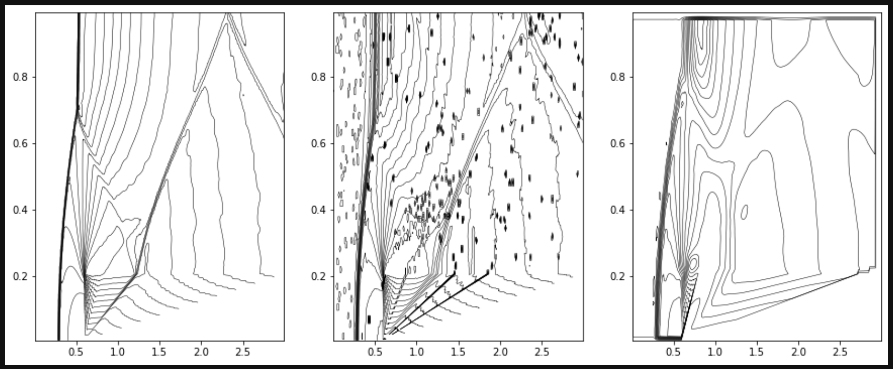
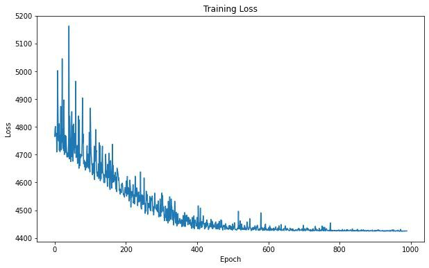
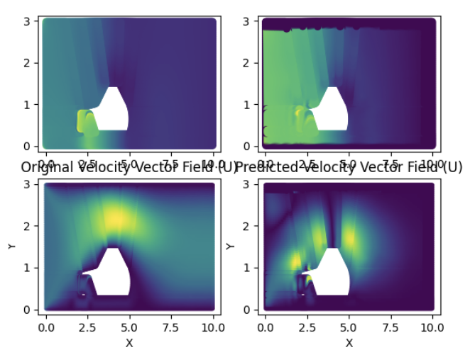
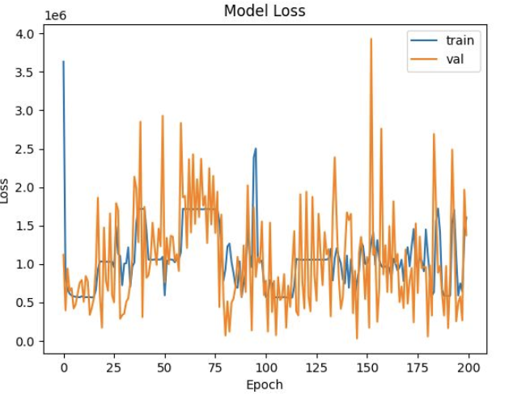

# Increasing-the-resolution-aerodynamic-fields

**Increasing-the-resolution-aerodynamic-fields**

*Nikita Matveev, Ivan Goncharov, Kirill Kozlov, Konstantin Novozhilov*

Cite : https://cogmodel.mipt.ru/iprofihack
Presentation : https://docs.google.com/presentation/d/18IgPd5W_ApYReopJNU5rFgRMgtnuzaSjgKBh24wzz3Q/edit#slide=id.p

## Abstract 
  В данном задании нам предлагалось поработать над созданием архитектуры для повышения разрешения поля скоростей и давления для дозвуковых течений. Мы пытались добиться хорошего результата с помощью CNN, Diffusion, модели интерполяции. Ниже изложены наши результаты

Dataset : https://drive.google.com/drive/folders/1oHYiSw6B5u-nK9LRpMCWqft3ucC8MmH7

В ветке CNN_autoEncoder предложен вариант решения с помощью сверточных нейронных сетей, мы использовали часть кода, а также некоторые идеи из статьи и репозитория, выложенных ниже.

# CNN (AutoEncoder):

- https://arxiv.org/pdf/2011.02364.pdf
- https://github.com/Jianxun-Wang/PICNNSR/tree/main/demo0

# AnisotropicDiffusion
В Ветке Kirill выложен код для имплементации  AnisotropicDiffusion для одной картинки

# Interpolation 
В файле interpolation.py представлен пример проведения интерполяции на одном кейсе симуляции для получения бейслайна.

# KNN
Метод ближайших соседей апроксимирует работу графовых нейронных сетей на примитивном уровне. По сути это упрощенная реализация MessagePassing слоя для GNN. В качестве входных данных были взяты значения соответсвующих векторных полей в соседних точках и расстояние до этих точек, а также (в текущей версии), были добавлены данные интерполяции.

